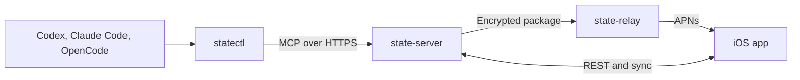

# State documentation

Everything needed to go from nothing to a working setup: a server you own, the
iOS app paired to it, and your coding agents writing into it.

If you only want the short version, read [Quickstart](#quickstart). Everything
after it explains the same steps in depth.

## Contents

- [What State is](#what-state-is)
- [How the pieces fit together](#how-the-pieces-fit-together)
- [Notes](#notes), with the [AI-managed Notes roadmap](docs/ai-managed-notes.md), its [review](docs/ai-managed-notes-review.md) and the [notes core plan](docs/superpowers/plans/2026-09-24-notes-core.md)
- [Quickstart](#quickstart)
- [Step 1: run the server](#step-1-run-the-server)
- [Step 2: connect the iOS app](#step-2-connect-the-ios-app)
- [Pairing codes and the QR code](#pairing-codes-and-the-qr-code)
- [Step 3: connect your agents](#step-3-connect-your-agents)
- [Agents on Windows](#agents-on-windows)
- [What an agent can and cannot do](#what-an-agent-can-and-cannot-do)
- [Notifications](#notifications)
- [Everyday commands](#everyday-commands)
- [Running it in production](#running-it-in-production)
- [Troubleshooting](#troubleshooting)

## What State is

Coding agents forget. The session ends, the context window rolls over, and the
thing you asked to be reminded about is gone.

State is a durable memory for exactly that. When you tell Codex, Claude Code or
OpenCode to remind you of something, the agent writes a reminder into State
through MCP. The reminder lives on a server you run. Your iPhone shows it,
alerts you when it is due, and records every change anyone made to it.

Three properties matter:

- **You own the data.** State talks only to a server you deploy. There is no
  State cloud account.
- **Everything is on the record.** Every mutation writes a signed audit event
  holding before and after snapshots, the changed fields, who did it, and the
  original wording that caused it. The chain is independently verifiable.
- **Agents are limited on purpose.** An agent can create, update and comment.
  It cannot archive or delete.

State is not an agent chat app, and it does not run remote subagents.

## How the pieces fit together



Four programs, and you need two of them to get started:

| Program | Where it runs | Needed to start? |
| --- | --- | --- |
| `state-server` | A machine you control | Yes |
| `State` (iOS app) | Your iPhone | Yes |
| `statectl` | Your Mac or Windows machine | Yes, for agents |
| `state-relay` | Shared or your own | No, only for remote push |

Local notifications work without the relay. The relay only exists so a reminder
can still reach you when the app has not been open and the server needs to nudge
it, and it never sees reminder plaintext.

## Quickstart

On the machine that will host the server:

```bash
git clone https://github.com/Nicremo/state.git
cd state
go build -o state-server ./cmd/state-server
STATE_DATA_DIR=./state_data STATE_HTTP_ADDR=127.0.0.1:8090 ./state-server serve
```

In a second terminal, print the one-time owner secret:

```bash
./state-server bootstrap-token --data ./state_data
```

In the iOS app: enter the server address, choose **First setup**, paste the
bootstrap token, tap **Connect**.

On your Mac or Windows machine:

```bash
go build -o statectl ./cmd/statectl
./statectl pair --server https://state.example.com --code ONE-TIME-CODE --harness codex
```

The one-time code comes from the iPhone, under **Settings → Connect an agent**.

## Step 1: run the server

### Requirements

Go 1.25 to build, or Docker Compose 2.39 or later to run the published images.
The server embeds PocketBase and SQLite, so there is no database to install.

### Build and run

```bash
go build -o state-server ./cmd/state-server
```

`serve` takes its settings from flags or the environment:

| Setting | Flag | Environment | Default |
| --- | --- | --- | --- |
| Data directory | `--data` | `STATE_DATA_DIR` | `/data` |
| Listen address | `--http` | `STATE_HTTP_ADDR` | `0.0.0.0:8090` |

```bash
STATE_DATA_DIR=./state_data STATE_HTTP_ADDR=127.0.0.1:8090 ./state-server serve
```

The data directory holds the SQLite database, the audit signing key and the
bootstrap token. Back it up, and keep it off any shared volume.

### The bootstrap token

```bash
./state-server bootstrap-token --data ./state_data
```

The command prints the token and creates it on first use, at
`<data>/state_secrets/bootstrap.token`. It is the secret that turns the first
device into the owner.

Treat it like a root password. Do not paste it into a chat, a commit or a shell
history file you keep.

### Put it behind HTTPS

The iOS app expects a real HTTPS address. The app stores its credential in the
Keychain and sends it as a bearer token, so plain HTTP would hand that
credential to anyone on the network.

Any reverse proxy works. The repository ships a Compose stack that publishes no
host ports and expects an external `proxy-network`:

```bash
docker compose -f deploy/compose.yaml build
docker compose -f deploy/compose.yaml up -d
docker compose -f deploy/compose.yaml ps
```

Health endpoints for your proxy or monitor:

- `GET /health/live`
- `GET /health/ready`
- `GET /version`

Read [`docs/operations.md`](docs/operations.md) before exposing it publicly. It
covers proxy settings, encrypted backups, restore verification and APNs.

## Step 2: connect the iOS app

Open State. The first screen asks for three things:

1. **Server address.** The full HTTPS address, for example
   `https://state.example.com`. Include the scheme.
2. **First setup or Pairing code.** Choose **First setup** and paste the
   bootstrap token if this is the first device. Choose **Pairing code** if State
   is already running on another device you own.
3. **Your name and a device name.** They appear in the audit history, so pick
   something you will recognize months later.

Tap **Connect**. The credential goes into the iOS Keychain and never leaves the
device. If you ever tap **Disconnect this device**, only that stored credential
is dropped; the server keeps every reminder.

There is also **Look around without a server**, which fills the app with sample
data so you can see what it does before deploying anything. Nothing in that mode
leaves the phone.

## Pairing codes and the QR code

State never reuses a secret between two identities. There are three ways in, and
they are for three different situations.

### The bootstrap token

Printed by the server, used exactly once, and it creates the owner. This is the
only secret that can make a device the owner.

### One-time pairing codes

Created by the owner, in the app, under **Settings → Connect an agent**. A code
is valid for a short time and for exactly one pairing. Exchanging it produces a
credential for that one identity.

Every agent you pair gets its own credential, which is why the audit history can
tell Codex from Claude Code, and why revoking one leaves the others working.

### The QR code

The QR code is only a shortcut for values you could also type. It encodes a URL
in this shape:

```
state://pair?server=https://state.example.com&bootstrap=BOOTSTRAP_TOKEN
```

or, for an already running installation:

```
state://pair?server=https://state.example.com&code=ONE-TIME-CODE
```

Scanning it fills in the server address and the secret. That is all it does.
The `server` parameter is required, and one of `bootstrap` or `code` has to be
present.

So when the app offers **Scan pairing QR code**, it is asking for a QR code you
produce. Anything that can render a QR code from a string works, for example:

```bash
printf 'state://pair?server=https://state.example.com&bootstrap=%s' \
  "$(./state-server bootstrap-token --data ./state_data)" | qrencode -t ANSIUTF8
```

If you would rather not generate one, ignore the button and type the two values.
It is the same result.

## Step 3: connect your agents

`statectl` is the local half. It holds the credential in your operating system
keyring, speaks MCP over STDIO to your agent, and forwards to your server over
HTTPS.

### Build it

```bash
go build -o statectl ./cmd/statectl
```

Put it somewhere on your `PATH`.

### Pair one agent

Create a one-time code in the iOS app under **Settings → Connect an agent**,
then run:

```bash
statectl pair \
  --server https://state.example.com \
  --code ONE-TIME-CODE \
  --harness codex \
  --profile codex
```

`--harness` is the label the server records. `--profile` is the local name for
the stored credential and defaults to the harness. Run the command once per
agent, with a fresh code each time.

A harness label is two to thirty-two characters of lower case letters, digits
and inner hyphens. `codex`, `claude-code` and `opencode` ship with a full
integration. Any other label, `pi` for example, pairs exactly the same way.

### What pairing writes

For the three shipped integrations, `statectl` backs up the existing global
configuration and then writes:

| Agent | MCP configuration | Rules file |
| --- | --- | --- |
| `codex` | `~/.codex/config.toml` | `~/.codex/AGENTS.md` |
| `claude-code` | `~/.claude.json` | `~/.claude/CLAUDE.md` |
| `opencode` | `~/.config/opencode/opencode.json` | `~/.config/opencode/AGENTS.md` |

The rules are written inside a marked block:

```
<!-- statectl:state:start -->
...
<!-- statectl:state:end -->
```

`statectl uninstall --harness codex` removes exactly that block and leaves the
rest of your file alone.

The credential itself never goes into those files. It lives in the operating
system keyring. The profile index lives at:

- macOS: `~/Library/Application Support/State/statectl.json`
- Linux: `~/.config/State/statectl.json`
- Windows: `%AppData%\State\statectl.json`

### Any other agent

For a label with no shipped integration, `statectl` stores the credential and
prints what to add rather than writing it:

```json
{
  "mcpServers": {
    "state": {
      "command": "statectl",
      "args": ["mcp", "--profile", "pi"]
    }
  }
}
```

Agents that want a command line instead of JSON use:

```bash
statectl mcp --profile pi
```

You can also force this behaviour for a shipped integration with
`--install=false`, if you prefer to manage your own configuration files.

### The rules statectl installs

The installed rule block asks the agent to fetch a bounded briefing at session
start and to record a reminder only when you explicitly ask for one, and only
after the server confirms it stored it. It also tells the agent to pass the
original wording, to use optimistic revision checks, and never to archive or
delete.

You can edit that block. `statectl` only rewrites it when you pair or install
again.

## Agents on Windows

`statectl` is a single Go binary and builds for Windows:

```bash
GOOS=windows GOARCH=amd64 go build -o statectl.exe ./cmd/statectl
```

Pairing, the keyring and `statectl mcp` work the same way. The configuration
paths above are resolved from your user profile, so `~/.codex/config.toml`
becomes `%USERPROFILE%\.codex\config.toml`.

If your agent reads its configuration from somewhere else on Windows, pair with
`--install=false` and paste the printed MCP server entry into whichever file
that agent actually uses. The credential is stored either way.

## What an agent can and cannot do

The MCP endpoint is `/mcp`, Streamable HTTP. It exposes these tools to agents:

| Tool | Purpose |
| --- | --- |
| `get_briefing` | Bounded current reminders plus changes since a cursor |
| `search_reminders` | Full text across reminders, comments and audit context |
| `get_reminder` | One reminder with comments, occurrences and full history |
| `get_changes` | Ordered audit changes after a sync cursor |
| `create_reminder` | Create exactly one reminder, idempotently |
| `update_reminder` | Update with an optimistic revision check |
| `add_comment` | Append context without replacing anything |
| `complete_occurrence` | Mark one due date complete |
| `snooze_occurrence` | Move one due date to an explicit UTC time |
| `search_notes` | Find notes by words, or list the newest; titles and summaries only |
| `get_note` | One note with its Markdown document and full history |
| `create_note` | Store a note the owner explicitly asked for |
| `update_note` | Change a note with an optimistic revision check |
| `add_note_attachment` | Attach a photo or recording the owner gave you (at most 8 MB) |
| `process_note` | Ask State's notes AI to transcribe, read and organize a note |
| `get_note_processing` | Processing status, AI title and summary, OCR text and transcripts |
| `list_related_notes` | Notes the notes AI linked, each with its reason |
| `get_notes_dictionary` | The owner's dictionary of spellings and misheard words (read only) |

Paired runners additionally see the five runner tools described in
[Scheduled agent execution](README.md#scheduled-agent-execution).

Agents cannot archive and cannot delete, neither reminders nor notes. That is enforced by the server, not by
the rules file, so an agent that ignores its instructions still cannot do it.

Every write requires a `client_request_id`, so a retried call returns the
original result instead of creating a duplicate. Every update requires an
`expected_revision`, so a stale edit fails loudly instead of overwriting someone
else's change.

The HTTP contract is in [`openapi/state-v1.yaml`](openapi/state-v1.yaml).

## Notes

Notes are the owner's unstructured knowledge next to reminders: one flat list,
newest change first, no folders, tags or categories. Search is the only way to
narrow it. The iPhone shows them in the Notes tab, the iPad and the Mac in the
sidebar. The large plus at the bottom right offers exactly three ways to start
a note: **Text**, **Photo** and **Voice**.

### Text and formatting

A note is a Markdown document, so every agent can read and write it. The editor
offers the formatting of iPhone Notes:

| iPhone Notes | Markdown |
| --- | --- |
| Title, heading, subheading | `#`, `##`, `###` (the "Aa" menu) |
| Bold, italic, strikethrough | `**x**`, `*x*`, `~~x~~` |
| Underline, highlight | `++x++`, `==x==` |
| Bulleted, dashed and numbered lists | `- `, `1. ` |
| Checklist | `- [ ] ` and `- [x] ` |
| Table | a pipe table with a `--- ` separator row |
| Divider | `---` |
| Collapsible section | every heading; tap it in the note to fold its section |

Without a written title the first line becomes the title, and the summary in
the list is derived from the text below it. A title or summary that someone
writes is never overwritten automatically. Tapping a checklist item ticks it.

### Photos, voice and the notes AI

**Photo** takes pages with the document camera or picks them from the library,
for example handwritten notebook pages. **Voice** records a voice note; long
recordings are split into segments the transcription can handle. The originals
are stored on the owner's server and stay attached to the note.

The server then processes the note with its own OpenRouter agent:

1. Recordings go to OpenRouter's speech-to-text endpoint
   (default `openai/whisper-large-v3-turbo`).
2. The notes agent (default `deepseek/deepseek-v4.1-flash`, which reads text
   and images and calls tools) reads photos and handwriting, writes the note
   body for a photo or voice note, and gives every note an AI title and
   summary. Its tools are limited to State: search and read other notes, look
   up reminders, link related notes, and propose reminders.
3. A proposed reminder appears on the note and becomes a reminder only when the
   owner taps **Create reminder**. Related notes appear with the reason.

What the AI produces is stored next to the note with its model, never in place
of what the owner wrote: a written title always wins, typed text is never
replaced (the AI's text is then offered as a suggestion), and every AI write is
a signed audit event by the `notes-agent` actor. Text notes are organized again
after an edit, 45 seconds after typing stops, unless only a checkbox changed.

**Voice notes** show one compact row in the note: play, **Recording** with its
length and an info button. The info button opens the recording screen with a
scrubber, 15 seconds back and forward and the full transcript. While it plays,
the passage being spoken is marked and kept in view; tapping a passage jumps
there. The times come from OpenRouter's `verbose_json` transcription; when a
provider returns none, the transcript is shown without marking. The note body
itself is never the transcript: the agent writes condensed bullet points or a
checklist, the server checks that it is a list in the model's own words, asks
once more if it is not, and otherwise marks the note for review instead of
filling it with the transcript. Nothing the notes AI writes contains an en dash
or an em dash; the server replaces them before storing.

**Dictionary.** Under **Settings, Notes AI, Dictionary** the owner keeps words
the notes AI spells exactly so, and corrections for words speech recognition
mishears. A correction set to **Always** is replaced in every transcript, as a
whole word, ignoring case and whether it was heard with a dot, hyphen or space
("Cloud.md", "Cloud-MD"). **By context** is for everyday words ("Note", "Cloud"):
only the notes agent corrects them, where the note shows that meaning. The agent
also reports other misheard variants of dictionary words, which are then
corrected in the transcript too. The transcript as it was heard is always kept.
Only the owner and the owner's devices change the dictionary; agents read it
with `get_notes_dictionary` or `statectl note dictionary`. A list can be pasted
in the app, one entry per line (`word: Term`, `always: heard -> meant`,
`context: heard -> meant`). A server can also fill an empty dictionary once at
start from `notes-dictionary-seed.txt` in its data directory (or the file named
by `STATE_NOTES_DICTIONARY_SEED_FILE`), so a personal list never has to be part
of the code.

The number of photos per note comes from the server: OpenRouter publishes the
model's modalities and context window but no image count, so the server allows
the smaller of its own limit (10 photos, 8 MB each, 40 MB in total) and what
the model's context leaves room for. The app never builds in a limit.

### Setting it up

1. Create an OpenRouter key with a spending limit on openrouter.ai.
2. In the app open **Settings, Notes AI, OpenRouter key**, paste the key and tap
   **Check and save key**. Only the owner and the owner's devices can do this;
   agents and runners cannot. The server checks the key with OpenRouter, keeps it
   readable only by the server user in `state_secrets/openrouter.key` and uses
   it at once, without a restart. The key is never sent back, never logged and
   not kept on the device. **Replace key** and **Remove key** work the same way.
3. Turn on **Process notes with AI**. That switch is the owner's consent;
   without it nothing is sent.

Servers without the app can take the key as a file instead: the same
`state_secrets/openrouter.key` in the data directory, or a file named by
`STATE_OPENROUTER_API_KEY_FILE`, read at start. The notes agent resolves
"tomorrow" or "on Friday" against the server's date and local time zone;
`STATE_TIME_ZONE` names another zone.

The same screen sets the monthly limit (default 10 USD) and shows this month's
spending. Every call is checked against the limit before it is made and counted
with the cost OpenRouter reports. Without a key, without consent or over the
limit, notes stay fully usable and show why they were not processed.

### Notes from agents and the terminal

Notes share the audit chain with reminders: every create, edit, archive and
restore is a signed event with its author and original wording. Agents read and
write notes through the MCP tools above or `statectl note`; only the owner and
devices archive them, change the AI settings or confirm proposed reminders.

```bash
statectl note list   --profile codex --query "ideen"
statectl note show   --profile codex --id NOTE_ID
printf '# Ideen\nNotizen mit Fotos' | \
  statectl note create --profile codex --document-file - --source-text "Leg eine Notiz an"
statectl note update --profile codex --id NOTE_ID --title "State Ideen" --source-text "Benenn sie um"

# A photo note from a file the owner named
statectl note create     --profile codex --capture image --source-text "Nimm die Seite als Notiz"
statectl note attach     --profile codex --id NOTE_ID --file seite.jpg --source-text "Nimm die Seite als Notiz"
statectl note process    --profile codex --id NOTE_ID
statectl note processing --profile codex --id NOTE_ID
statectl note related    --profile codex --id NOTE_ID
statectl note dictionary --profile codex
```

## Notifications

State schedules alerts locally on the iPhone. That is what makes them reliable:
they fire while your server is down, offline or mid-deploy.

The alerts are marked time sensitive, so they come through Focus modes.

Remote push exists only for due dates the phone has not confirmed, and as a hint
that something changed. The payload is encrypted for the target device before it
reaches the relay, using X25519 key agreement, HKDF and AES-GCM. The relay sees
an opaque route identifier and a sealed envelope. If decryption fails, the app
shows generic text rather than guessing.

The public relay starts in APNs dry-run mode until real credentials and a
permanent domain are configured.

## Everyday commands

```bash
statectl doctor --profile codex     # check the credential and reach the server
statectl rotate --profile codex     # replace the credential, keep the identity
statectl revoke --profile codex     # tell the server to reject this credential
statectl unpair --profile codex     # forget the profile locally
statectl uninstall --harness codex  # remove the MCP entry and the rule block
statectl version
```

On the server:

```bash
state-server verify-audit --data ./state_data   # recompute the audit hash chain
state-server version
```

In the app, **Settings → Agents** lists every paired agent with a revoke button,
and **Settings → Devices** does the same for devices.

## Running it in production

- Put the server behind a reverse proxy with a real certificate. Enable HSTS
  only after the first successful pairing.
- Take encrypted backups. `ops/backup-state.sh`, `ops/restore-state.sh` and
  `ops/verify-backup.sh` use age, and the verify script restores into an empty
  volume so you find out that a backup is broken before you need it.
- Rotate agent credentials with `statectl rotate` rather than re-pairing.
- Keep the data directory on storage you actually back up.
- Read [`docs/operations.md`](docs/operations.md) and
  [`docs/threat-model.md`](docs/threat-model.md).

The owner-controlled server can read reminder content. It has to: search,
briefings and the MCP tools all operate on the text. What it does not do is send
that text anywhere else.

## Troubleshooting

**The app says it cannot reach the server.**
Check `GET /health/ready` from the phone's network, not just from the host. A
server bound to `127.0.0.1` is not reachable from your phone.

**Connect fails with the bootstrap token.**
The token is single use for creating the owner. If an owner already exists,
create a pairing code in the app instead.

**`statectl pair` reports an invalid code.**
Codes expire and work once. Create a new one in the app.

**The agent does not mention State at all.**
Check that the MCP entry landed: `statectl doctor --profile <name>`. Then check
that the rules block is present in the agent's instruction file. Some agents
need a restart before they read a changed configuration.

**An update fails with a conflict.**
Something else changed that reminder first. In the app the conflict appears
under Activity with both versions and the changed field names. Agents get an
HTTP 409 and are expected to re-read before retrying.

**Notifications never arrive.**
Check **Settings → Notifications → Delivery and privacy** in the app for the
system permission state. Local alerts need no server at all, so if those are
missing the permission is the cause.

---

Licensed under Apache-2.0. Issues and pull requests are welcome at
[github.com/Nicremo/state](https://github.com/Nicremo/state).
