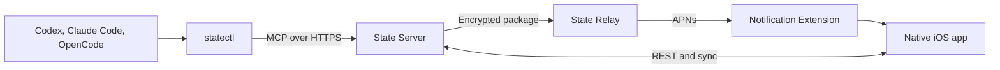

# State

State gives coding agents a durable, auditable memory for reminders while keeping the owner in control. It synchronizes reminders, comments, revisions, conflicts and complete history between Codex, Claude Code, OpenCode and a native iOS app.

State is built for technical self-hosters. It is not an agent chat app and it does not execute remote subagents.

## Components

- `state-server`: One Go binary with embedded PocketBase, REST, Streamable HTTP MCP, scheduling, full-text search and a signed audit chain.
- `state-relay`: A separate Go service that delivers encrypted APNs payloads without receiving reminder plaintext.
- `statectl`: A signed CLI, secure pairing client and local STDIO adapter for agent harnesses.
- `State`: A native SwiftUI app for iOS 18 or later with GRDB offline storage and a Notification Service Extension.



## Capabilities

- UUIDv7 identifiers and UTC server timestamps.
- Optimistic concurrency through required `expected_revision` values.
- Stable `client_request_id` values for idempotent offline writes.
- Atomic mutations and audit events in one SQLite transaction.
- Immutable, signed and independently verifiable audit hash chain.
- Actor-specific permissions for owners, devices, harnesses and system work.
- Recurring daily, weekly, monthly and yearly occurrences with time zone semantics.
- Full-text search across reminders, comments and audit summaries.
- Offline iOS reads, queued writes and explicit conflict resolution.
- Local rolling notifications with encrypted server push fallback.
- German and English UI, Dark Mode, Dynamic Type and VoiceOver labels.

## Quick start

Requirements are Go 1.25, Docker Compose 2.39 or later and Xcode 26 for iOS development.

```bash
go test -race ./...
go build -o state-server ./cmd/state-server
go build -o state-relay ./cmd/state-relay
go build -o statectl ./cmd/statectl
```

Start a development server:

```bash
STATE_DATA_DIR=./state_data STATE_HTTP_ADDR=127.0.0.1:8090 ./state-server serve
./state-server bootstrap-token --data ./state_data
```

The bootstrap token is a one-time owner setup secret. Do not store it in shell history or source control.

Generate and test the iOS project:

```bash
cd ios
xcodegen generate
xcodebuild -project State.xcodeproj -scheme State \
  -destination 'platform=iOS Simulator,name=iPhone 16 Pro' \
  CODE_SIGNING_ALLOWED=NO test
```

## Pair an agent harness

Create a one-time harness code in the iOS app, then run one command for each identity:

```bash
statectl pair \
  --server https://state.example.com \
  --code ONE_TIME_CODE \
  --harness codex \
  --profile codex
```

Run that command once per agent. Every pairing creates its own actor with its own credential, so any number of agents can stay connected at the same time and each one appears separately in the audit history.

A harness value is any label of two to thirty-two characters made of lower case letters, digits and inner hyphens. `codex`, `claude-code` and `opencode` ship with a full integration: `statectl` stores the credential in the operating system keychain, backs up the existing global configuration and installs a marked rule block. The rule requests a limited briefing at session start and records explicit reminder intent only after the server confirms persistence.

Any other label, `pi` for example, pairs exactly the same way. `statectl` stores the credential and prints the MCP server entry plus the agent rules instead of writing them, so you add them to that agent's own configuration:

```bash
statectl pair --server https://state.example.com --code ONE_TIME_CODE --harness pi
```

Useful commands:

```bash
statectl doctor --profile codex
statectl rotate --profile codex
statectl revoke --profile codex
statectl uninstall --harness codex
```

## MCP tools

The Streamable HTTP endpoint is `/mcp`. It exposes:

- `get_briefing`
- `search_reminders`
- `get_reminder`
- `get_changes`
- `create_reminder`
- `update_reminder`
- `add_comment`
- `complete_occurrence`
- `snooze_occurrence`

The HTTP contract is documented in [`openapi/state-v1.yaml`](openapi/state-v1.yaml).

## Deployment

The production-shaped Compose stack publishes no host ports. Nginx Proxy Manager reaches both services through the external `proxy-network`.

```bash
docker compose -f deploy/compose.yaml build
docker compose -f deploy/compose.yaml up -d
docker compose -f deploy/compose.yaml ps
```

Read [`docs/operations.md`](docs/operations.md) before exposing the service. It includes proxy settings, health checks, encrypted backups, restore verification and APNs activation.

## Security and privacy

The personal State server can read reminder content because MCP tools and full-text search require it. Harnesses receive separate revocable credentials and cannot archive or delete reminders. Push content is encrypted for the target device before it reaches the shared relay. Backups are encrypted with age.

See [`SECURITY.md`](SECURITY.md), [`PRIVACY.md`](PRIVACY.md) and [`docs/threat-model.md`](docs/threat-model.md).

## Project status

Version 1 implements the complete reminder core. Attachments, teams, voice alarms, general chat, embeddings, remote subagent execution and Context Cards are intentionally outside this release.

The public relay starts in APNs dry-run mode until protected Apple credentials and a permanent domain are configured. Development and TestFlight may use an `sslip.io` endpoint, but public App Store distribution must use a durable domain.

## License

Apache-2.0. See [`LICENSE`](LICENSE).
