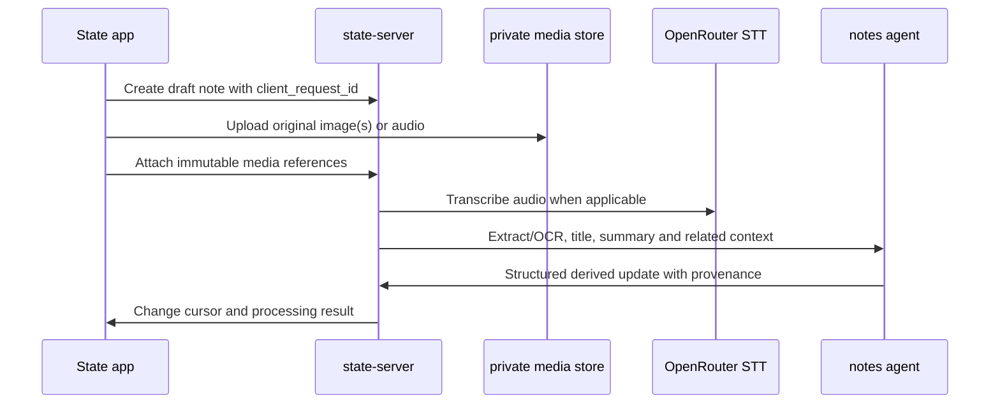

# AI-managed notes

**Status:** Product and architecture specification. Stage A (notes core) and Stage B (photos, voice, OpenRouter notes agent) are implemented; see [the review](ai-managed-notes-review.md) for the binding deviations and [the Stage B plan](superpowers/plans/2026-09-25-notes-ai.md).

**Source:** [`ai-managed-notes-transcript.md`](ai-managed-notes-transcript.md)

## 1. Decision

State gains a deliberately small, Apple Notes-like **Notes** area. It is a
separate product surface from reminders:

- Reminders are explicit obligations with dates, recurrence and completion.
- Notes are durable, unstructured personal knowledge with no categories,
  folders, tags or note-level schedules in version one.
- A single global, full-text search is the only way to narrow the notes list.
- State may use AI to turn supplied text, images and speech into usable note
  content and context. The AI must not make hidden product decisions, mutate
  unrelated records, or expose provider credentials to an iOS device.

The result should feel simpler than Apple Notes, not like a second project
manager that happened to acquire a text field. Categories are intentionally
out of scope. Apparently every note app eventually invents a taxonomy maze.
State does not need one.

## 2. User experience

### 2.1 Navigation and list

The iPhone `TabView` gets a **Notes** tab in the bottom navigation bar. Its
primary screen is one reverse-chronological list of all active notes, newest
updated first. A row contains only:

1. the title,
2. a short generated or user-authored summary, and
3. lightweight recency information such as `Updated today`.

There are no folders, notebooks, tags, category chips, smart collections or
per-category filters. Pull to refresh and a global search field are allowed.
Search matches title, visible rich-text content, extracted image text,
transcripts and AI-derived searchable text. Search results still have the same
flat list presentation.

Archived notes do not appear in the normal list or normal search. They remain
recoverable through an explicit archive view or an `include_archived` API
parameter. State must never hard-delete a note or original attachment through
an agent tool.

### 2.2 Create flow

The Notes tab has one prominent floating `+` action at bottom trailing on
phone. Tapping it opens exactly three choices:

| Choice | First action | Saved result |
| --- | --- | --- |
| **Text** | Open a blank note editor. | A note with rich text. |
| **Photo** | Take a photo or choose existing photos. | One note with ordered image attachments and AI-derived text. |
| **Audio** | Record or choose an audio file. | One note with the original audio and a transcript. |

The system asks only for the camera, photo-library or microphone permission
needed by the selected flow. Cancelling the picker or recorder creates nothing.
The client first stores the original content, then requests processing. An
upload or processing failure remains visible on that note and does not pretend
the material was understood.

### 2.3 Text editor

The editor follows the iPhone Notes interaction model rather than copying its
entire feature catalogue. The first non-empty line is the title. The rest is
the body. It supports the same practical formatting surface the current iPhone
Notes app exposes for ordinary note writing:

- Title, heading and subheading paragraph styles
- Bold, italic, underline, strikethrough and highlight
- Bulleted, numbered and dashed lists
- Indentation and quote style where the native text system supports it
- Checklists
- Tables
- Divider lines
- Collapsible heading sections
- Inline images and audio attachments

State uses a versioned structured rich-text document, not presentation HTML.
The transport representation must preserve semantic block and inline marks, be
safe to render on iOS and be convertible to accessible plain text for search,
MCP and CLI output. A future editor implementation may choose SwiftUI's
`AttributedString` plus a document schema, but must not make an opaque Apple
archive the server's canonical format.

Apple documents that the first line becomes a note title and that iPhone Notes
supports text styles, checklists, tables, divider lines, collapsible sections,
photos, document scans and in-note audio transcription. State copies the small
creation and formatting experience, not folders, tags, collaboration or Apple
Intelligence features. See [Apple's create and format notes guide](https://support.apple.com/guide/iphone/create-and-format-notes-iph1ac0b3a2/ios).

## 3. Capture and AI processing

### 3.1 Canonical material versus derived material

A note has two classes of content:

| Class | Examples | Who may change it |
| --- | --- | --- |
| Canonical user material | Rich-text document, original image bytes, original audio bytes, manually edited title and summary | The owner or a direct, explicit State client mutation |
| Derived material | OCR text, transcript, inferred title, concise summary, embeddings, links to related notes, processing status and model provenance | The processing service, in an auditable, revisioned operation |

Original media is never replaced with OCR or a transcript. A handwritten page
remains a photo even when its text was extracted perfectly. A spoken note
remains playable audio even when it was transcribed. This distinction makes
reprocessing with a new model possible and makes model errors repairable.

The note creation pipeline is asynchronous and idempotent:



Each stage records durable status: `queued`, `uploading`, `processing`,
`ready`, `failed` or `needs_review`. Retrying uses the same content hash and
client request identifier. A failure contains a safe, human-readable cause and
never discards original material.

### 3.2 Text notes

Text notes save locally and synchronize like reminders. On a stable save, the
server may ask the notes agent to propose an inferred title and short summary
only when the user did not enter them. It must not rewrite a user title or a
user-edited summary. The generated summary is shown in the list, capped to a
small product-defined length, and always has a `derived` provenance marker
server-side.

### 3.3 Photos, handwritten pages and scans

The photo flow accepts one or more images in an ordered batch. It is intended
for normal photos, camera captures, document pages and handwritten notebook
pages. The processing agent receives the images in their user-selected order
plus a bounded retrieval context of relevant existing notes. It returns:

- extracted text, including handwriting when legible,
- a concise title,
- a concise summary,
- optional proposed rich-text body that clearly marks uncertain text, and
- links to related existing notes with a relevance reason.

The original image attachment remains the source of truth. The UI must make it
possible to inspect the image beside derived text and correct the generated
body. A low-confidence result moves to `needs_review`, not to confident
fiction. Revolutionary concept: do not let a model guess what handwriting says
and quietly call that a record.

**Image-count rule:** the app must not hard-code an arbitrary maximum. Before
opening the picker it requests the selected vision model's current capability
from State. The selectable count is the minimum of:

1. a State server safety limit for total bytes and processing cost,
2. the selected model/provider's published maximum image count and request
   size, and
3. any plan or device limit.

The server validates this again. If OpenRouter does not expose a trustworthy
per-provider image-count limit for the selected route, State must choose its
configured conservative limit and show it to the user. It must not advertise
"unlimited" based on missing metadata.

### 3.4 Audio and transcription

Audio uses OpenRouter's dedicated speech-to-text endpoint, not a chat prompt
that merely asks a general model to transcribe. The first production candidate
is configured server-side and may be `openai/whisper-large-v3` or another model
returned by OpenRouter's live transcription catalogue. Model selection remains
configuration, not an iOS release.

The application sends audio to
`POST /api/v1/audio/transcriptions` as OpenRouter-supported multipart form data
or base64 JSON. It stores the returned transcript and, when requested, segment
or word timestamps. For long recordings, the client uses a compressed format
such as Opus or M4A where available and the server splits the job before an
upstream timeout. OpenRouter currently documents a 25 MB multipart cap and an
upstream processing timeout around 60 seconds, so one giant recording is not a
credible product plan.

After successful transcription, the notes agent produces a title, short list
summary and optionally a formatted note body. The transcript remains separately
visible and editable. The app must state which parts were transcribed and
which parts were AI-organized.

OpenRouter's current [STT documentation](https://openrouter.ai/docs/guides/overview/multimodal/stt)
describes the endpoint, live model discovery through
`output_modalities=transcription`, supported formats and `verbose_json`
timestamps.

## 4. OpenRouter model architecture

### 4.1 Server-side gateway

The iOS app never receives an OpenRouter API key and never contacts OpenRouter
directly. `state-server` owns a `notes-ai` gateway with the key in server-side
secret storage. The gateway applies authentication, per-owner rate limits,
request-size limits, model allow-lists, cost ceilings, timeouts, redaction,
retry policy and audit provenance.

The gateway has distinct configured roles:

| Role | Default selection | Required capabilities |
| --- | --- | --- |
| Notes agent | `deepseek/deepseek-v4.1-flash` | Text and image input, tool calling, structured outputs, long context |
| Speech-to-text | Server-selected OpenRouter transcription model | `transcription` output modality |
| Optional fallback vision model | Server configuration | Text and image input, structured outputs |
| Embeddings or retrieval model | Server configuration, optional | Durable semantic retrieval only after a privacy review |

As of the research for this document, OpenRouter lists
`deepseek/deepseek-v4.1-flash` with `text+image -> text`, a 1,048,576-token
context window, structured output support and tool calling. It is therefore a
valid candidate for the notes agent and accepts images. It is **not** an STT
model, so audio remains on the dedicated transcription path. Model availability,
limits, prices and provider support change. State resolves the configured model
through OpenRouter's Models API at startup and periodically thereafter, then
disables a feature safely if the required capability has disappeared.

OpenRouter documents multi-image requests but explicitly says allowed image
counts vary by model and provider. The models API exposes modality and supported
parameters, not a universal safe image-count promise. State must use runtime
capability data plus server policy as described above. See OpenRouter's
[image-input guide](https://openrouter.ai/docs/guides/overview/multimodal/image-understanding)
and [models API guide](https://openrouter.ai/docs/guides/overview/models).

### 4.2 Agent framework choice

The implementation may use Mastra or Vercel AI SDK, but no framework is the
product contract. The initial recommendation is a thin server-owned agent loop
around the OpenRouter OpenAI-compatible API, with a typed tool registry and
JSON-schema output validation. Add Mastra or Vercel AI SDK only if it reduces
that code without widening the trust boundary. Both frameworks are an
implementation detail. The safe tool contract is not.

The agent receives a task-scoped system instruction, user material, bounded
retrieval candidates, a tool allow-list and a response schema. It has no shell,
network, credential, runner, deployment, payment, messaging or arbitrary MCP
access. Tool calls are executed server-side and audit-recorded under a dedicated
`notes-agent` actor.

### 4.3 Allowed tools

The first agent release exposes only these narrow State tools:

| Tool | Permission | Constraint |
| --- | --- | --- |
| `search_notes` | Read | Bounded result count, safe fields only, query and result IDs audited |
| `get_note` | Read | One explicit note ID or a server-selected retrieval candidate |
| `get_note_excerpt` | Read | Bounded plain-text range and attachment metadata, never raw secret-store paths |
| `propose_note_update` | Write proposal | Returns a patch for the current note only, subject to schema validation |
| `link_related_note` | Write | Creates a reversible related-note edge with reason and confidence |
| `create_reminder_from_note` | Proposal only | Requires explicit owner confirmation in the app before a reminder is created |

There is no tool to delete notes, read every note without a retrieval budget,
write a second note, alter a reminder directly, run agents, invoke arbitrary
MCP tools, browse the web or access files. A user can explicitly ask State to
create a reminder from a note, but an inference such as "this sounds important"
is not consent to create an obligation.

### 4.4 Context retrieval

The user wants notes to work together, but sending an entire lifetime notebook
on every request would be expensive, slow and spectacularly bad for privacy.
The agent gets context in layers:

1. the current note and its supplied media,
2. exact full-text matches and recent notes from the server index,
3. optional semantic candidates only when a reviewed embedding feature is
   enabled, and
4. compact excerpts selected under a strict token and attachment budget.

Returned links must be explainable: every relationship records why the other
note was selected. The agent has no hidden memory outside State's stored,
revisioned note data and auditable retrieval requests.

## 5. Data model and storage

Notes do not overload the `Reminder` table. They use independent entities and
sync cursors while sharing State's actor, revision, audit and idempotency
infrastructure.

```text
Note
  id, title, title_source, document, plain_text, summary, summary_source,
  status, archived, revision, created_at, updated_at

NoteAttachment
  id, note_id, ordinal, kind(image|audio), content_hash, media_ref,
  mime_type, byte_size, duration_ms?, created_at

NoteDerivedContent
  id, note_id, attachment_id?, kind(ocr|transcript|summary|embedding),
  content, language?, confidence?, model, model_version?, provider?,
  source_hash, created_at, superseded_at?

NoteRelation
  id, from_note_id, to_note_id, reason, confidence?, created_by,
  created_at, archived_at?

NoteProcessingJob
  id, note_id, attachment_id?, kind(transcription|vision|organization),
  status, attempt, idempotency_key, model, provider?, error_code?,
  error_message?, started_at?, completed_at?
```

Media bytes live in owner-controlled private object storage or a protected
filesystem location outside the public web root. `media_ref` is an opaque
server reference, never a public OpenRouter URL. The server streams or
base64-encodes only the job's approved attachment to the gateway. Content hashes
detect accidental duplicates and bind derived content to the exact original
version.

Every create, update, archive, attach, processing transition, derived write and
relation mutation creates a signed audit event. The audit event identifies the
owner device, paired harness, State system worker or `notes-agent` actor. It
records structured before/after snapshots or safe digests, changed fields,
source hash, model, provider and correlation ID. It must never record an
OpenRouter key, raw authorization header, full provider request dump or private
media bytes.

## 6. REST, sync and offline behavior

Add versioned endpoints alongside the reminder API:

```text
POST   /api/v1/notes
GET    /api/v1/notes?q=&include_archived=&limit=&cursor=
GET    /api/v1/notes/{id}
PATCH  /api/v1/notes/{id}
POST   /api/v1/notes/{id}/archive
POST   /api/v1/notes/{id}/attachments
POST   /api/v1/notes/{id}/processing
GET    /api/v1/notes/{id}/processing
GET    /api/v1/notes/{id}/relations
POST   /api/v1/notes/{id}/relations
GET    /api/v1/notes/{id}/history
GET    /api/v1/note-capabilities
```

Large media upload uses a dedicated authenticated upload protocol with bounded
content length, MIME allow-list, content hashing and resumability if required.
The standard JSON body limit must not be silently bypassed for photos or audio.
The server creates an attachment only after it has validated the stored object
and hash.

The iOS GRDB cache gets notes, attachments, derived content summaries,
relations, pending mutations and processing state. The app queues local edits
with stable client request IDs and uses `expected_revision` for edits. A 409
creates a visible rich-text conflict rather than one writer silently erasing
another person's note. Sync pagination and changes cursors must include note
changes without making existing reminder clients download attachment bytes.

## 7. MCP and CLI contract

Every paired State harness gains notes access through the same authenticated
profile. MCP is not a raw database escape hatch. It exposes these tools:

```text
get_notes_briefing(after_cursor?, limit?)
search_notes(query, limit?, include_archived?)
get_note(note_id)
create_note(title?, document?, source_excerpt?, client_request_id)
update_note(note_id, expected_revision, title?, document?, summary?)
archive_note(note_id, expected_revision, client_request_id)
add_note_attachment(note_id, upload_reference, ordinal, client_request_id)
get_note_processing(note_id)
list_related_notes(note_id)
create_reminder_from_note(note_id, proposed_reminder)
```

Rules for agent clients:

- Read notes only when relevant to the user's current request.
- Create or edit a note only from an explicit user instruction.
- Do not send local file paths, credentials, raw logs or arbitrary URLs as
  attachment content.
- Do not claim an AI summary is user-authored.
- Read the current revision before any mutation and report success only after
  State confirms storage.
- `create_reminder_from_note` returns a proposal. The State app must receive
  an explicit owner approval before State persists the reminder.

`statectl` gets exact CLI parity, including noninteractive JSON output:

```text
statectl note list --query <query> --limit <n> --json
statectl note get <note-id> --json
statectl note create --title <title> --file <document.json> --json
statectl note update <note-id> --expected-revision <n> --file <document.json>
statectl note attach <note-id> --file <path> --kind image|audio
statectl note processing <note-id> --json
statectl note related <note-id> --json
statectl note archive <note-id> --expected-revision <n>
```

The CLI reads files only after the user deliberately names them and uploads
through the authenticated server. It does not send a file directly to
OpenRouter, does not read directories and does not bypass attachment validation.

## 8. Privacy, safety and cost controls

1. **Owner-controlled data remains the default.** State's server, database and
   media store remain owner controlled. Using OpenRouter is an explicit external
   processing feature and must be disclosed in Settings before first use.
2. **No client-side key.** Only the server owns the OpenRouter credential.
3. **No silent destructive AI actions.** The agent cannot delete, archive or
   overwrite user-authored note content.
4. **Bounded context.** Retrieval has item, byte and token budgets. The whole
   notebook is never transmitted by default.
5. **Attachment caps.** Enforce configurable image count, image/audio bytes,
   duration, total request bytes, concurrent jobs and monthly spend caps on the
   server before provider submission.
6. **Graceful degradation.** Notes are still editable and readable while AI is
   disabled, unavailable, out of budget or unsupported. A failed AI job does
   not block the note itself.
7. **Provenance.** Every generated title, summary, OCR, transcript and relation
   is attributable to source material, model and processing time.
8. **Data lifecycle.** The owner can reprocess a note, discard a derived output,
   delete original media only through a direct owner action, and export notes
   plus their attachments and provenance.
9. **Network isolation.** The notes agent has no tools outside the small State
   registry. It cannot access State runners or use a note as an instruction to
   execute code.

## 9. Acceptance criteria

### Core notes

- [ ] Notes is a bottom-navigation tab on iPhone and a first-class selection in
      iPad and macOS layouts.
- [ ] The default list shows all active notes ordered by `updated_at` descending,
      with title and short summary only.
- [ ] There are no category, tag, folder or notebook controls in the first
      release.
- [ ] Global search covers title, document plain text, OCR and transcripts.
- [ ] The `+` flow offers only Text, Photo and Audio.
- [ ] Text editing preserves semantic formatting, checklists, tables, divider
      lines, collapsible headings and inline attachments across sync and
      offline restart.

### Image and audio capture

- [ ] A photo batch preserves original ordered images and the generated OCR or
      handwriting result is reviewable next to them.
- [ ] The maximum photo count is obtained from `note-capabilities` and enforced
      again by the server.
- [ ] Audio stores the original file and shows a transcript with processing
      state and error handling.
- [ ] A failed upload, STT or vision job never loses original material or shows
      a false ready state.

### AI and operations

- [ ] `deepseek/deepseek-v4.1-flash` is capability-checked at runtime before
      use for notes agent tasks and is never assumed to transcribe audio.
- [ ] The configured STT model is discovered from OpenRouter's live
      transcription catalogue and selected server-side.
- [ ] The agent can retrieve only bounded note context and use only the
      documented State tool allow-list.
- [ ] AI never creates a reminder or alters another note without explicit owner
      confirmation.
- [ ] All derived content has source and model provenance.
- [ ] Existing reminder, runner, MCP and CLI behavior remains unchanged.

### Engineering quality

- [ ] Database migrations are forward-only and preserve existing State data.
- [ ] REST, MCP and CLI validation reject malformed rich-text documents,
      unauthorized media references, stale revisions and oversized uploads.
- [ ] Tests cover idempotent processing jobs, content-hash binding, rich-text
      round trips, sync conflicts, search indexing, archive recovery, model
      capability fallback and tool authorization.
- [ ] The OpenAPI document, `DOCUMENTATION.md`, onboarding copy, privacy copy
      and iOS localizations are updated in the implementation PRs.

## 10. Suggested implementation sequence

1. Define the note domain models, migration, signed audit events, repository
   methods and pure service tests.
2. Add authenticated REST and change-cursor support, then document the OpenAPI
   contract.
3. Add iOS offline schemas, sync queue and a read-only Notes list/detail view.
4. Add the semantic rich-text editor and Text capture flow with round-trip
   tests.
5. Add private media storage, verified attachment upload and Photo capture.
6. Add the notes AI gateway, OpenRouter capability discovery, vision processing
   queue and review UI.
7. Add Audio capture and dedicated STT processing, including long-recording
   splitting and transcript UI.
8. Add bounded relation retrieval and the narrow notes agent tool registry.
9. Add MCP tools and exact `statectl note` parity.
10. Add export, privacy settings, spend controls, observability and end-to-end
    device tests.

Each stage must leave notes useful without the later AI stages. A plain note
that syncs reliably is more valuable than a theatrical agent with nothing safe
to store.
