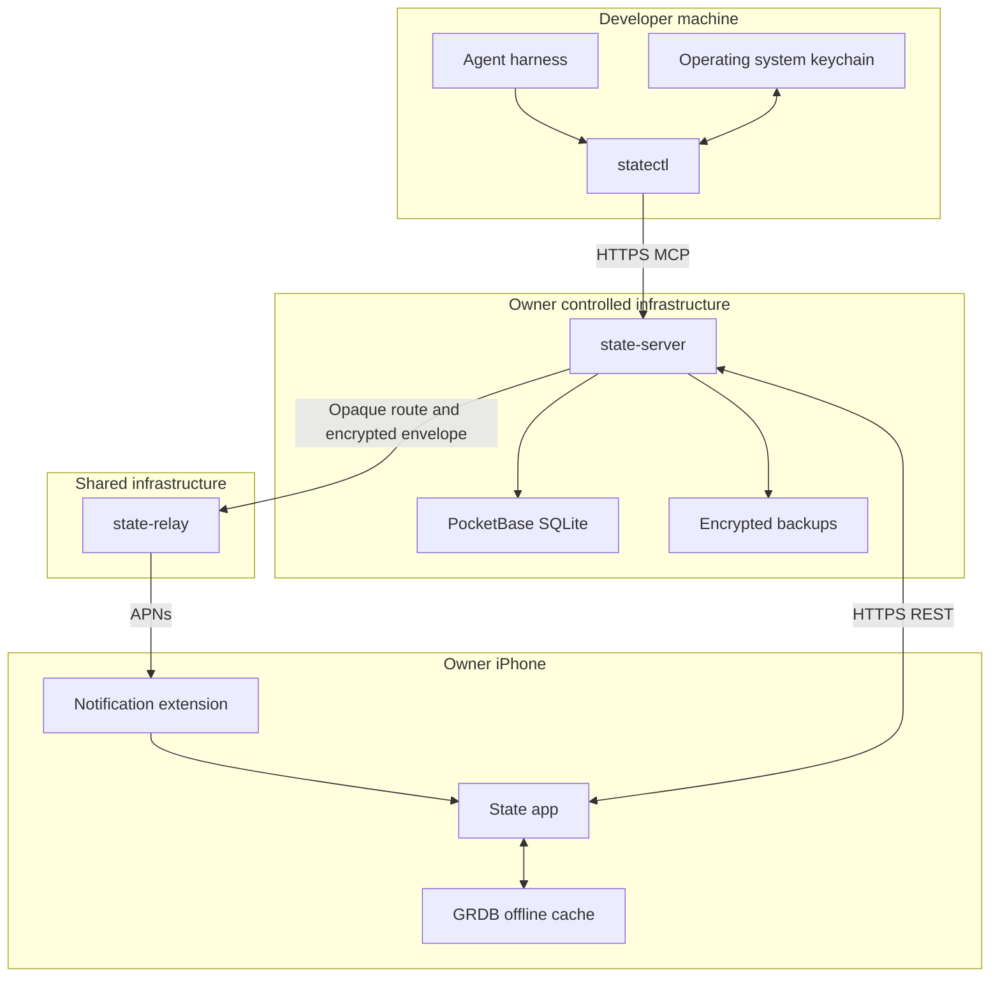

# Architecture

## Trust boundaries

## Server write path

1. Authentication maps a credential to an `Actor`.
2. The API validates actor permissions, `client_request_id` and `expected_revision`.
3. One SQLite transaction writes the domain mutation and its audit event.
4. The event stores before and after snapshots, changed fields, source excerpt, server and client time, correlation ID and revision.
5. The event hash includes the prior hash and a server signature.
6. Full-text search projections update in the same persistence boundary.
7. A duplicate request identifier returns the original result without a second mutation.

## Sync path

The app uses a monotonic changes cursor. It stores downloaded details and cursor updates transactionally. Local writes enter a durable queue with stable request identifiers. The sync engine sends queued operations in order, then pulls remote changes. HTTP 409 responses become local `Conflict` records containing server state, local intent and field names. Resolving a conflict creates a normal, audited server mutation.

## Reminder scheduling

Schedules retain a local date, optional local time, IANA time zone, fixed or floating behavior and advance notice. Recurrence generation uses calendar semantics instead of adding fixed durations. Each generated `Occurrence` can be completed or snoozed independently.

The iOS app maintains a rolling set of local notifications and confirms protected occurrence identifiers to the server. The server uses encrypted remote push only for unconfirmed due occurrences or as a synchronization hint.

## Data visibility

The owner-controlled server can read reminder content. This is required for search, briefings and MCP tools. The relay cannot decrypt reminder payloads. Device private keys never leave the Keychain.

## Contracts

- REST: versioned under `/api/v1` and described by OpenAPI.
- MCP: Streamable HTTP at `/mcp` using the negotiated stable protocol version.
- CLI adapter: MCP over STDIO between the harness and `statectl`.
- Push: X25519 key agreement, HKDF key derivation and AES-GCM authenticated encryption.
