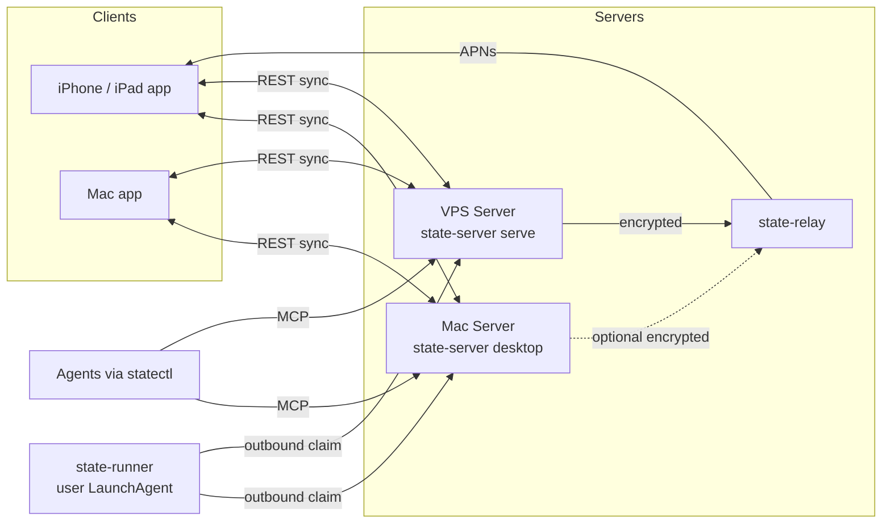

# WP01: Architektur-Dokument `docs/product-lineup.md`

**Welle:** 1 · **Slug:** `product-lineup-doc` · **Branch:** `wp/01-product-lineup-doc`
**Besitzt:** `docs/product-lineup.md` (neu), `README.md` (nur Abschnitt "## Components" und das Mermaid-Diagramm darunter)
**Geschätzter Umfang:** klein, nur Doku

## Goal-Prompt (so an die Worker-Session geben)

> Lies `docs/plans/2026-09-23-product-lineup/README.md` vollständig und halte dich an das Arbeitsprotokoll in Abschnitt 4. Setze danach `docs/plans/2026-09-23-product-lineup/WP01-product-lineup-doc.md` Task für Task um. Arbeite nur in deinem eigenen Worktree. Schließe mit Report und Draft-PR ab.

## Ziel

Ein englisches Architektur-Dokument, das die vier Produkte (iPhone/iPad-App, Mac-App, Mac Server, VPS Server) beschreibt: wer mit wem spricht, welche Ports, welche Push-Wege, wo der Runner läuft, welche Grenzen gelten. Das Dokument ist die Referenz für alle anderen WPs und für Fabian.

## Pflichtlektüre vor dem Schreiben

Lies diese Dateien vollständig, sie sind deine Quellen. **Erfinde nichts, was dort nicht steht oder im Master-Plan festgelegt ist.**

1. `docs/plans/2026-09-23-product-lineup/README.md` (Abschnitt 1 und 2 sind die verbindlichen Entscheidungen)
2. `README.md`
3. `docs/architecture.md`
4. `docs/LOCAL_MAC_CONNECTION.md`
5. `macos/README.md`
6. `docs/universal-agent-todo-capture.md`
7. `docs/operations.md`
8. `deploy/compose.yaml`

## Task 1: Dokument anlegen

**Datei:** `docs/product-lineup.md` (Englisch, Stil wie `docs/architecture.md`: sachlich, kurze Absätze, Tabellen)

Pflichtgliederung, genau diese Überschriften in dieser Reihenfolge:

```markdown
# State product lineup

**Status:** Target architecture
**Related:** [architecture](architecture.md), [local Mac connection](LOCAL_MAC_CONNECTION.md), [universal agent todo capture](universal-agent-todo-capture.md)

## 1. Products at a glance
## 2. One server, two packagings
## 3. One client, three form factors
## 4. Connection matrix
## 5. Notifications and push
## 6. Agents, statectl and the runner
## 7. Choosing a deployment
## 8. Security boundaries
## 9. Known limits
## 10. Work packages
```

Inhalt je Abschnitt:

1. **Products at a glance:** Tabelle mit Spalten `Product | Target user situation | Code location | Distribution`. Vier Zeilen:
   - State for iPhone and iPad: `ios/State`, TestFlight/App Store
   - State for Mac: new native macOS target `StateMac` in `ios/project.yml`, TestFlight/App Store (same bundle ID `com.fabincrm.state`, universal purchase)
   - State Mac Server: `macos/` menu bar app wrapping `state-server desktop`, ad hoc or Developer ID signed build
   - State VPS Server: `deploy/compose.yaml` with `state-server serve` and `state-relay`, container images
2. **One server, two packagings:** Erkläre, dass `cmd/state-server` zwei Modi hat. `serve` (VPS, HTTP auf 8090 hinter einem TLS-Reverse-Proxy) und `desktop` (Mac, HTTPS auf 9847 für das LAN mit selbstsigniertem Zertifikat und Pin im QR-Code, HTTP auf 127.0.0.1:9848 für lokale Programme). Datenmodell, API, MCP und Audit-Kette sind identisch.
3. **One client, three form factors:** iPhone behält `TabView`. iPad und Mac nutzen `NavigationSplitView`. Code wird geteilt, plattformspezifische APIs (Zwischenablage, QR-Scanner, App-Delegate, Farben) liegen hinter einer kleinen Plattform-Schicht in `ios/State/Sources/Platform/`. Mac ist ein natives Target, kein Catalyst. Begründung in zwei Sätzen: bessere Mac-Bedienung (Menüs, Tastenkürzel, Fenster) und keine UIKit-Kompromisse.
4. **Connection matrix:** Tabelle `Client | Mac Server | VPS Server`. Zeilen: iPhone, iPad, Mac app, statectl (agents), state-runner. Zellen nennen Adresse und Authentisierung, z.B. iPhone + Mac Server: `https://<name>.local:9847`, certificate pin from QR plus device credential, LAN only. Mac app + Mac Server auf demselben Rechner: `http://127.0.0.1:9848`. statectl + VPS: `https://state.<domain>/mcp` mit Harness-Credential.
5. **Notifications and push:** Drei Wege beschreiben:
   - Lokale, rollierende Mitteilungen auf jedem Gerät aus synchronisierten Daten (funktionieren offline).
   - Verschlüsselter APNs-Push über `state-relay` nur für iPhone und iPad, weil das Relay App Attest verlangt und App Attest auf dem Mac nicht nutzbar ist.
   - Der Mac Server kann optional ein öffentliches Relay auf dem VPS nutzen. Dafür wird die Relay-URL im iPhone einstellbar (WP07). Ohne Relay gilt: Sync nur im LAN, Mitteilungen nur lokal.
   - Die Mac-App bekommt keine Relay-Pushes. Sie synchronisiert, solange sie läuft, und plant lokale Mitteilungen.
6. **Agents, statectl and the runner:** statectl ist MCP-Proxy und CLI für jeden Agenten (eigene Identität pro Agent). Der `state-runner` läuft auf einem Arbeitsrechner als eigener LaunchAgent (`state-runner service install`), weil die sandboxed Mac-App aus dem App Store keine Agenten-CLIs starten darf. Die Apps zeigen seinen Status und liefern Pairing-Code und Installationsbefehl. Er holt fällige Agent-Runs ausgehend ab, egal ob der Server auf dem Mac oder dem VPS läuft. Ein VPS-Runner ist optional und nur für Projekte, die dort liegen. Verweis auf `universal-agent-todo-capture.md`.
7. **Choosing a deployment:** Tabelle mit drei Szenarien: "Mac Server only", "VPS Server only", "Mac Server plus VPS relay". Spalten: Push outside home network, Data location, Setup effort, Needs domain.
8. **Security boundaries:** Die Grenzen aus Abschnitt 2 Punkt 7 des Master-Plans, plus: Port 9847 akzeptiert nur private, Loopback- und Link-Local-Adressen, Port 9848 nur Loopback. Das Relay sieht keinen Klartext.
9. **Known limits:** Mac Server läuft nur, wenn der Mac wach und eingeloggt ist. iOS erlaubt kein dauerhaftes Hintergrund-Polling. Mac-App ohne APNs. Ein Client, ein Server.
10. **Work packages:** Tabelle WP01 bis WP11 mit Titel und Welle, verlinkt auf die Plan-Dateien unter `plans/2026-09-23-product-lineup/`.

Füge unter Abschnitt 1 ein Mermaid-Diagramm ein (GitHub rendert Mermaid). Vorlage, darf sprachlich angepasst, aber nicht inhaltlich verändert werden:

````markdown

````

**Commit:**

```bash
git add docs/product-lineup.md
git commit -m "docs: describe the four-product State lineup"
```

## Task 2: README verlinken

In `README.md` im Abschnitt `## Components`:

1. Unter der bestehenden Liste einen Absatz ergänzen: `See [the product lineup](docs/product-lineup.md) for how the iPhone, iPad and Mac apps, the Mac Server and the VPS Server fit together.`
2. Nichts anderes in `README.md` ändern.

Prüfen, dass alle relativen Links in beiden Dateien existieren:

```bash
python3 - <<'EOF'
import re, pathlib
for doc in ["docs/product-lineup.md", "README.md"]:
    base = pathlib.Path(doc).parent
    for link in re.findall(r"\]\(([^)#:]+)(?:#[^)]*)?\)", pathlib.Path(doc).read_text()):
        if not (base / link).exists():
            print("BROKEN", doc, link)
print("link check done")
EOF
```

Erwartet: nur `link check done`, keine `BROKEN`-Zeile.

**Commit:**

```bash
git add README.md
git commit -m "docs: link the product lineup from the README"
```

## Task 3: Selbstprüfung

- [ ] Jede der zehn Überschriften vorhanden, Reihenfolge stimmt.
- [ ] Keine Aussage, die dem Master-Plan Abschnitt 2 widerspricht.
- [ ] Portnummern 8090, 8091, 9847, 9848 stimmen mit `deploy/compose.yaml` und `macos/README.md` überein.
- [ ] Keine Domains, Tokens oder persönlichen Daten außer der bereits öffentlichen Bundle-ID.
- [ ] Link-Check grün.

Danach Report und Draft-PR nach Master-Plan Abschnitt 4.4 und 4.5.
