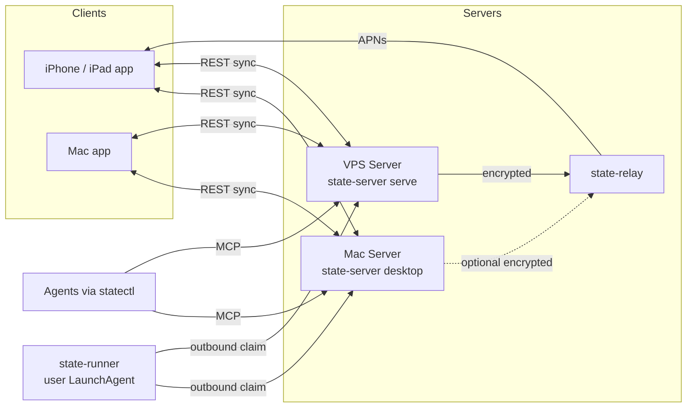

# State product lineup

**Status:** Target architecture
**Related:** [architecture](architecture.md), [local Mac connection](LOCAL_MAC_CONNECTION.md), [universal agent todo capture](universal-agent-todo-capture.md)

The lineup covers four products: two apps, one Mac Server and one VPS Server. The iPhone, iPad and Mac apps share one client code base, and the Mac Server and the VPS Server are the same Go binary in two modes.

## 1. Products at a glance

| Product | Target user situation | Code location | Distribution |
| --- | --- | --- | --- |
| State for iPhone and iPad | Capture, review and complete reminders away from the desk, with offline reads and local notifications. | `ios/State` | TestFlight and App Store |
| State for Mac | The same app as a native macOS target for desk work, with menus, keyboard shortcuts and real windows. | New native macOS target `StateMac` in `ios/project.yml` | TestFlight and App Store, same bundle ID `com.fabincrm.state`, universal purchase |
| State Mac Server | A private server on the owner's own Mac for the home network, paired by QR code, without a cloud account. | `macos/` menu bar app wrapping `state-server desktop` | Ad hoc or Developer ID signed build |
| State VPS Server | A reachable server with encrypted push for work outside the home network. | `deploy/compose.yaml` with `state-server serve` and `state-relay` | Container images |

The diagram shows who talks to whom.

The dashed connection from the Mac Server to the relay is optional and arrives with WP07.

## 2. One server, two packagings

`cmd/state-server` is one binary with two operating modes.

`serve` is the VPS mode. It speaks plain HTTP on port 8090 and expects a TLS reverse proxy in front of it. The Compose stack publishes no host ports and joins the external proxy network, so only the proxy reaches `state-server` on 8090 and `state-relay` on 8091.

`desktop` is the Mac mode. It serves HTTPS on port 9847 for the local network using a self-signed certificate whose SHA-256 fingerprint travels inside the pairing QR code, and it serves plain HTTP on `127.0.0.1:9848` for local programs such as `statectl`. Management runs over inherited process pipes, not over a network endpoint, and the mode requires a `.local` Bonjour hostname.

Both modes keep the same data model, the same REST API under `/api/v1`, the same MCP endpoint at `/mcp`, the same scheduler and the same signed audit chain. Only the transport and the packaging differ. Desktop data lives in `~/Library/Application Support/State Server`, private to the current user. Server data lives in the `/data` volume.

## 3. One client, three form factors

The iPhone keeps its `TabView`. iPad and Mac use a `NavigationSplitView` with a sidebar, a list and a detail column.

All three form factors share the Swift code in `ios/State/Sources`. Platform-specific APIs such as the pasteboard, the QR scanner, the app delegate and colour handling sit behind a small platform layer in `ios/State/Sources/Platform/`.

The Mac app is a native macOS target, not Mac Catalyst and not "Designed for iPad". A native target gives proper Mac behaviour with menus, keyboard shortcuts and real windows. It also avoids the UIKit compromises that a Catalyst build would bring into an app whose whole interface is SwiftUI.

## 4. Connection matrix

| Client | Mac Server | VPS Server |
| --- | --- | --- |
| iPhone | `https://<Mac name>.local:9847` Certificate pin from the QR code plus a per-device credential. Local network only. | `https://state.<domain>` Public TLS plus a per-device credential. |
| iPad | Same as iPhone. | Same as iPhone. |
| Mac app | `http://127.0.0.1:9848` on the same Mac, with a device credential. | `https://state.<domain>` with a device credential. |
| statectl (agents) | `http://127.0.0.1:9848/mcp` on the same Mac, with a per-agent harness credential. | `https://state.<domain>/mcp` with a per-agent harness credential. |
| state-runner | Outbound long-poll REST against the configured server URL with a runner credential. On the same Mac the loopback address is enough. | Outbound long-poll REST against `https://state.<domain>` with a runner credential. |

The transports follow the existing contracts: apps use versioned REST and the sync protocol, agents use Streamable HTTP MCP, and the runner polls outbound only. One client is paired with exactly one server, and switching servers happens in the settings.

## 5. Notifications and push

State uses three notification paths.

- **Local notifications on every device.** Each device derives rolling local notifications from synchronized data, so reminders still fire while a server is unreachable. This path works offline.
- **Encrypted APNs push for iPhone and iPad.** The server sends an encrypted envelope through `state-relay`, which forwards it to APNs. Production delivery requires App Attest, which is not usable on the Mac, so this path stays limited to iPhone and iPad. The committed stack still allows development attest and runs APNs in dry-run mode until a permanent relay domain and Apple credentials exist.
- **An optional relay for the Mac Server.** A Mac Server may use a public relay on the VPS. That requires the relay address to become configurable in the iPhone app, which is WP07. Without a relay, a Mac Server synchronizes in the local network and its clients notify locally.

The Mac app itself never receives a relay push. It synchronizes while it runs and schedules local notifications from the data it holds.

Notification delivery never implies execution permission. Recurring occurrences stay independent, and a failed agent run does not complete its occurrence.

## 6. Agents, statectl and the runner

`statectl` is the MCP proxy and the CLI for every agent. Each agent pairs with its own identity and its own revocable credential, so the audit history shows which harness captured which reminder. Codex, Claude Code and OpenCode have installed integrations. Other labels such as DeepSeek Harness or Pi Agent receive an MCP declaration and agent rules to install manually.

`state-runner` runs on a work machine as its own user LaunchAgent, installed once with `state-runner service install`. It does not live inside an app bundle, because the App Store build of the Mac app runs in the App Sandbox, and a sandboxed app may not start agent CLIs in project folders or create LaunchAgents. The apps show the runner status and provide the pairing code and the finished install command. The runner claims due agent runs outbound only, whether the server runs on the Mac or on the VPS. The server never sends shell commands to a machine; a run carries a hash-pinned contract that names a project, an adapter and allowed capabilities.

A runner on the VPS is optional and only for projects that live on that server. The full capture and execution model is specified in [universal agent todo capture](universal-agent-todo-capture.md).

## 7. Choosing a deployment

| Deployment | Push outside the home network | Data location | Setup effort | Needs a domain |
| --- | --- | --- | --- | --- |
| Mac Server only | No. Local notifications only. | On the Mac, in `~/Library/Application Support/State Server`. | Lowest: build the menu bar app and scan the QR code. | No |
| VPS Server only | Yes, through `state-relay` and APNs. | On the server, in the Compose volumes. | Medium: Compose stack, reverse proxy, TLS certificate and an APNs key. | Yes |
| Mac Server plus VPS relay | Yes for iPhone and iPad. | Reminder data on the Mac. The VPS carries opaque encrypted payloads. | Higher: both parts, plus a configurable relay address in the iPhone app. | Yes, for the relay |

## 8. Security boundaries

- The server never sends shell commands to a machine. A reminder records what should happen and when, never executable text.
- A runner creates only outbound connections and claims its own work. No inbound SSH, exposed terminal or server-initiated shell access is required.
- Reminders, task contracts, `.state/` and push payloads contain no credentials, private keys or unrestricted commands.
- Port 9847 accepts requests from private, loopback and link-local addresses only.
- Port 9848 binds exclusively to loopback.
- The relay sees no plaintext. Push payloads are encrypted for the target device before they reach the shared relay, and device private keys never leave the Keychain.
- The owner-controlled server can read reminder content, because MCP tools, briefings and full text search require it.
- Desktop management uses inherited process pipes only. There is no HTTP management endpoint, no router configuration and no public tunnel.
- Pairing codes are single use and valid for ten minutes. A pinned client accepts exactly the certificate of the selected origin and rejects redirects and certificate changes, without adding system-wide trust.
- The shipped Compose stack publishes no host ports, runs read-only with all capabilities dropped and drops privileges to an unprivileged user.

## 9. Known limits

- The Mac Server runs only while the Mac is awake and the user is logged in. It does not prevent sleep.
- iOS does not permit uninterrupted arbitrary background polling. The app synchronizes on foreground and every 15 seconds while it is active and paired with a local certificate.
- The Mac app has no APNs path, so it never receives a remote push.
- One client is connected to one server at a time. There are no parallel server connections.
- A released iOS build that predates the certificate pin cannot pair with a Mac Server. The updated client is required.

## 10. Work packages

The [plan set](plans/2026-09-23-product-lineup/README.md) lists every package with its wave, its dependencies and its plan file. Wave 1 runs in parallel, wave 2 starts after wave 1 is merged, and wave 3 closes the lineup.

| Package | Title | Wave |
| --- | --- | --- |
| WP01 | [Architecture document](plans/2026-09-23-product-lineup/WP01-product-lineup-doc.md) | 1 |
| WP02 | [Harden the Mac Server app](plans/2026-09-23-product-lineup/WP02-mac-server-app.md) | 1 |
| WP03 | [VPS deploy kit](plans/2026-09-23-product-lineup/WP03-vps-deploy-kit.md) | 1 |
| WP04 | [`statectl reminder` commands](plans/2026-09-23-product-lineup/WP04-statectl-reminder-cli.md) | 1 |
| WP05 | [Capture rules and manual harness integration](plans/2026-09-23-product-lineup/WP05-agent-capture-rules.md) | 1 |
| WP06 | [macOS target and platform abstraction](plans/2026-09-23-product-lineup/WP06-macos-client-target.md) | 1 |
| WP07 | [Configurable relay address, Mac Server with VPS relay](plans/2026-09-23-product-lineup/WP07-relay-for-local-server.md) | 2 |
| WP08 | [Runner adapters for Pi Agent and DeepSeek Harness](plans/2026-09-23-product-lineup/WP08-runner-adapters.md) | 1 |
| WP09 | [iPad and Mac layout with `NavigationSplitView`](plans/2026-09-23-product-lineup/WP09-adaptive-layout.md) | 2 |
| WP10 | [Runner as a LaunchAgent, status and install command in the app](plans/2026-09-23-product-lineup/WP10-runner-in-mac-app.md) | 2 |
| WP11 | [Release pipeline: Fastlane for macOS and iPad, TestFlight](plans/2026-09-23-product-lineup/WP11-release-pipeline.md) | 3 |
